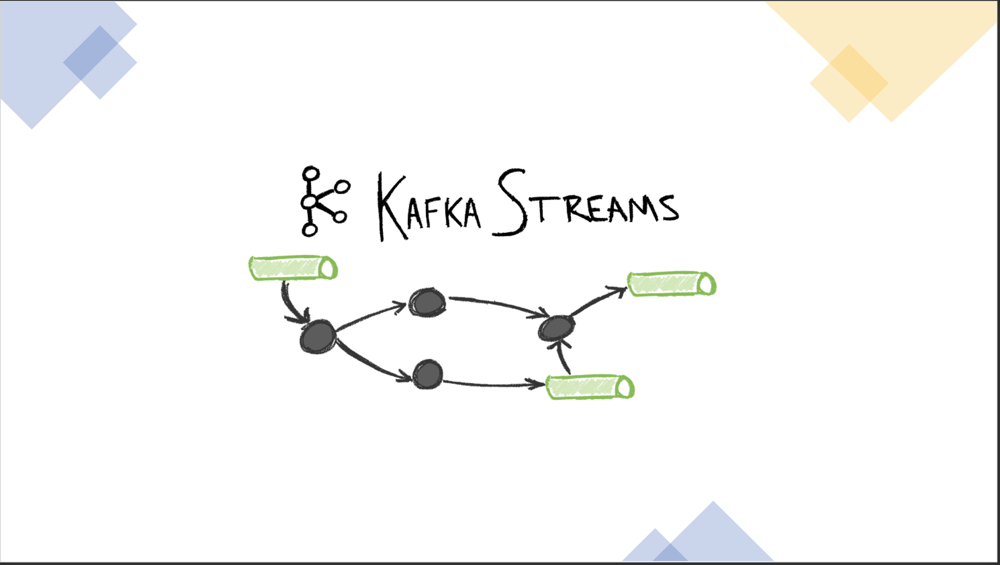
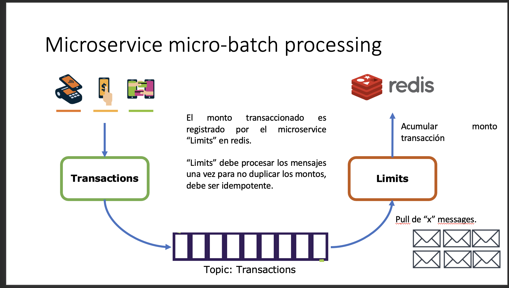
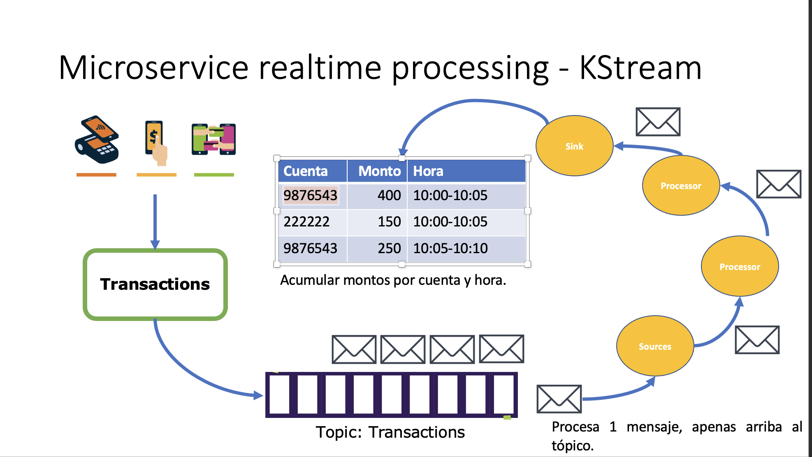

# Realtime processing con Kafka Stream




## Microbatch


## Real time processing


## Caso práctico


### Paso a paso


https://youtu.be/QMSdKVNpddc

## Run

```shell

cd ./scripts

docker-compose up

docker exec -it kafka01 bash

kafka-console-consumer --topic t.transactions --bootstrap-server localhost:9092 \
  --property "print.key=true"\
  --property "key.deserializer=org.apache.kafka.common.serialization.StringDeserializer" \
  --property "value.deserializer=org.apache.kafka.common.serialization.StringDeserializer" \
  --from-beginning

kafka-console-consumer --topic t.transactions.statistics --bootstrap-server localhost:9092 \
  --property "key.deserializer=org.apache.kafka.common.serialization.StringDeserializer" \
  --property "value.deserializer=org.apache.kafka.common.serialization.StringDeserializer" \
  --from-beginning  


```
