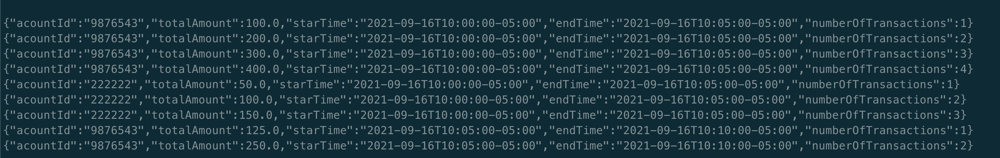

# Realtime processing con Kafka Stream


## Microbatch


## Real time processing


## Resumen de operaciones


### Paso a paso


https://youtu.be/emutAnQw_vs

## Run

```shell

cd ./scripts

docker-compose up

docker exec -it kafka01 bash

kafka-console-consumer --topic t.transactions --bootstrap-server localhost:9092 \
  --property "print.key=true"\
  --property "key.deserializer=org.apache.kafka.common.serialization.StringDeserializer" \
  --property "value.deserializer=org.apache.kafka.common.serialization.StringDeserializer" \
  --from-beginning

kafka-console-consumer --topic t.transactions.statistics --bootstrap-server localhost:9092 \
  --property "key.deserializer=org.apache.kafka.common.serialization.StringDeserializer" \
  --property "value.deserializer=org.apache.kafka.common.serialization.StringDeserializer" \
  --from-beginning  

kafka-topics --list --bootstrap-server localhost:9092

```

## KSQL
```shell
docker exec -it ksqldb-cli ksql http://ksqldb-server:8088

SET 'auto.offset.reset' = 'earliest';

drop STREAM transactionsST;

CREATE STREAM transactionsST (originId VARCHAR,destinationId VARCHAR, amount DOUBLE, created VARCHAR) 
WITH (
    kafka_topic='t.transactions', 
    value_format='json',
    timestamp='created',
    timestamp_format='yyyy-MM-dd''T''HH:mm:ssX' 
  );
 
select * from transactionsST; 
                
                      
CREATE TABLE transactionsDaily AS
  select originId,
          SUM(amount) AS TOTAL,
          COUNT(1) AS COUNT
  FROM transactionsST
  WINDOW TUMBLING (SIZE 1 DAY) 
  GROUP BY originId
  EMIT CHANGES;
  
SELECT * FROM transactionsDaily;
SELECT * FROM transactionsDaily EMIT CHANGES;

SELECT 
      originId,
       TIMESTAMPTOSTRING(WINDOWSTART, 'yyyy-MM-dd HH:mm:ss.SSS') AS ts_start,
       TIMESTAMPTOSTRING(WINDOWEND, 'yyyy-MM-dd HH:mm:ss.SSS') AS ts_end,
       TOTAL,
       COUNT
FROM transactionsDaily
EMIT CHANGES;


kafka-console-consumer --topic TRANSACTIONSDAILY --bootstrap-server localhost:9092 \
  --property "key.deserializer=org.apache.kafka.common.serialization.StringDeserializer" \
  --property "value.deserializer=org.apache.kafka.common.serialization.StringDeserializer" \
  --from-beginning  


```
